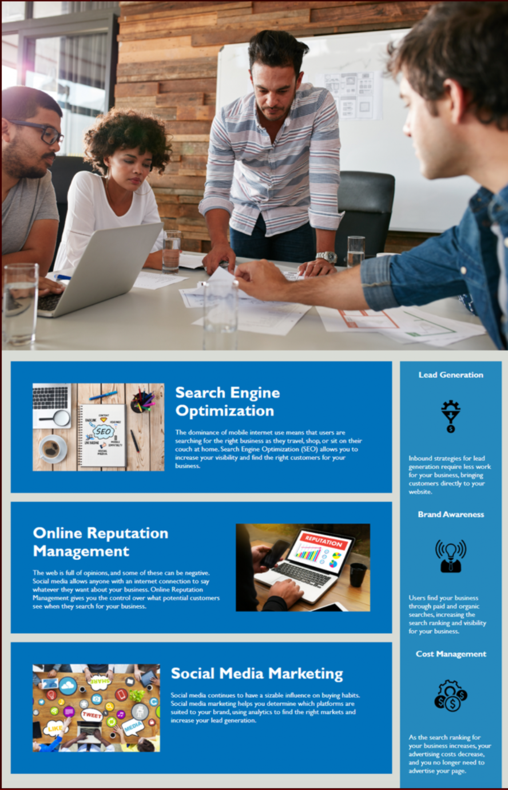

# fun-horiseon

[link to LIVE site](https://github.com/Mvint2647/fun-horiseon)

## Table of Contents

1.[Description](#Description)

2.[Screen Shots](#Screenshots)

3.[License](#License)

4.[Usage](#Usage)

5.[Badges](#Badges)

## Description
A mock-up optimizaton of my searched website.

## Screenshots

## License
MIT

## Usage

## Badges
HTML & Style.CSS